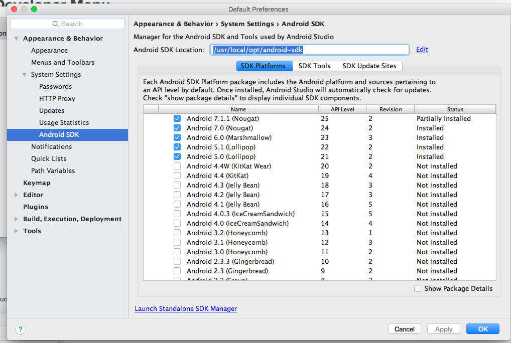
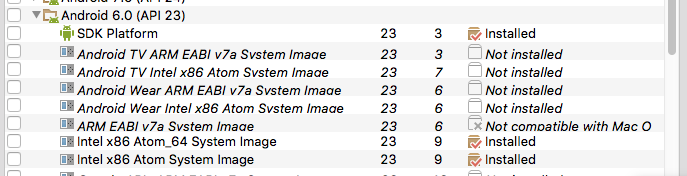

How to Run the App on iOS or Android
====================================

The following steps assume that you are developing on Mac.

## Common setup
  - Clone this repo: `git clone https://github.com/kiddkevin00/spiritual-guide.git`.
  - Install Xcode and update to the latest version.
  - Download and install [Android Studio](https://developer.android.com/studio/index.html).

## Install dependencies from NPM
  - Install all dependencies by running `npm install`.

### Extra configuration for Android
  - Open [Getting Started](http://facebook.github.io/react-native/docs/getting-started.html) and click the **Android** button under **macOS** for reference.
  - Run `brew install android-sdk`.
  - [Optional] Add `export ANDROID_HOME=/usr/local/opt/android-sdk` to "~/.bashrc", "~/.bash_profile" or "~/.zshrc" (ZSH).
  - Open Android Studio and click **Configure**.
  - Edit Android SDK Location to be `/usr/local/opt/android-sdk` && Select all API levels that are 23+
     - 
  - Click on **Show Package Details** in the bottom and make sure to install the following packages:
     - Select Android SDK Platform (API level 23) under SDK Platforms tab
     - Select all Intel x86 System Images (API level 23) under SDK Platforms tab
     - Select Android SDK Build-Tools 23.0.1 under SDK Tools tab
     - 
  - Create file in "$HOME/.gradle/gradle.properties" and add `REACT_NATIVE_PACKAGER_PORT = 8085` to it.

## Run on iOS
  - `cd spiritual-guide`
  - `react-native start`
  - `react-native run-ios`

## Run on Android
  - `cd spiritual-guide`
  - `react-native start`
  - `npm run map-adb-ports;` [8097 (Nuclide/Atom)](https://github.com/facebook/nuclide/issues/408)
  - `react-native run-android`

## General tips when running the app
- `react-native run-android` or `react-native run-ios` only needs to be run once to install the app on a device, unless there is any change to native code.
- `npm run map-adb-ports` needs to be run every time a emulator starts or a physical Android device is re-connected.
- Normal Steps is to run `react-native start`(Start Server) && `react-native run-(platform)`(ios | android) to build the app on a device.
